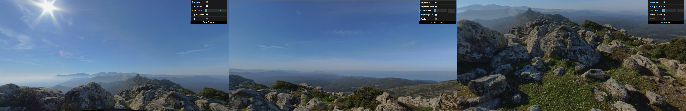
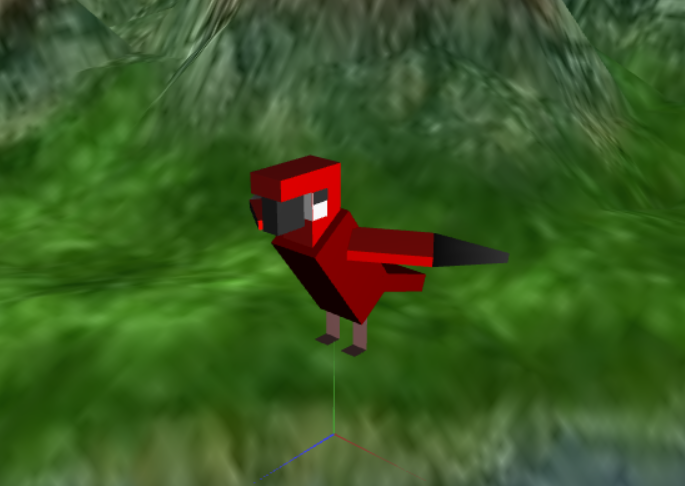
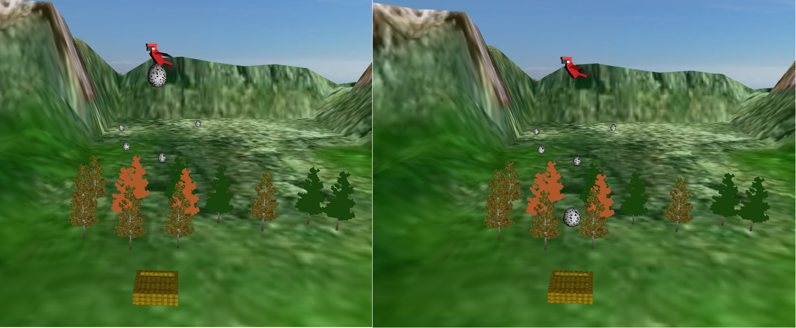
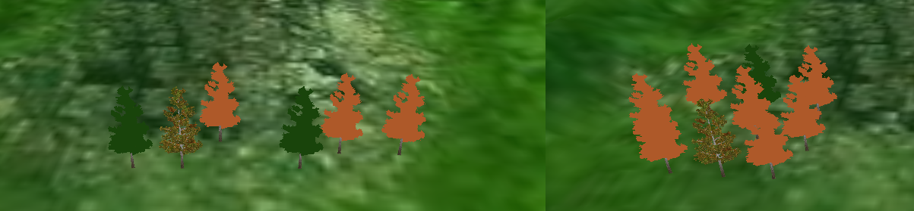
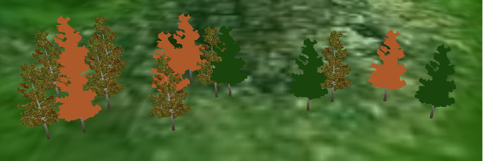

# CG 2022/2023

## Group T01G07
| Name             | Number    | E-Mail             |
| ---------------- | --------- | ------------------ |
| David Fang       | 202004179 | up202004179@up.pt  |
| Miguel Tavares   | 202002811 | up202002811@up.pt  | 

## Observations
Every feature was implemented. Although there could be some improvements in the code.

## Screenshots

<i>Screenshot 1 - Panorama</i>

<i>Screenshot 2 - Bird</i>

<i>Screenshot 3 - Terrain</i>

<i>Screenshot 4 - Nest and egg</i>

<i>Screenshot 5 - Trees</i>

<i>Screenshot 6 - Additional feature</i>

<i>Gif 6 - Additional feature in gif</i>
