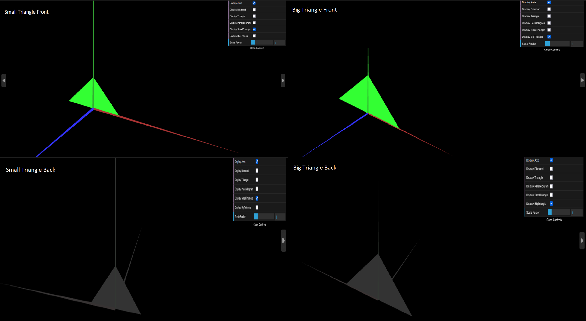

# CG 2022/2023

## Group T01G07

## TP 1 Notes

In the exercises 1 and 2: 

-  we have learned how to create a subclass to reproduce a shape;
-  we have learned how to toggle the visibility of the shapes;
-  we have learned how to add the other side of the shape;
-  we had difficulties in finding out how to add the other side of the shape at first. 

*exercise 2*
