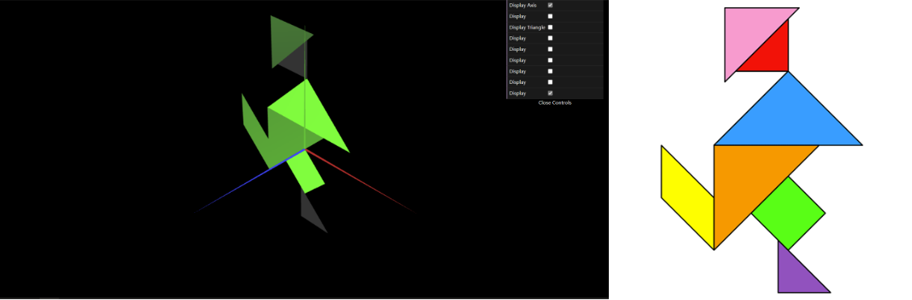
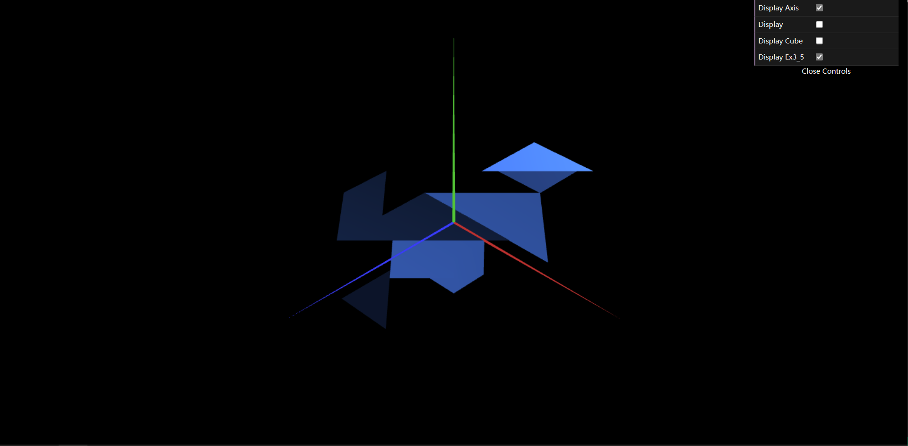
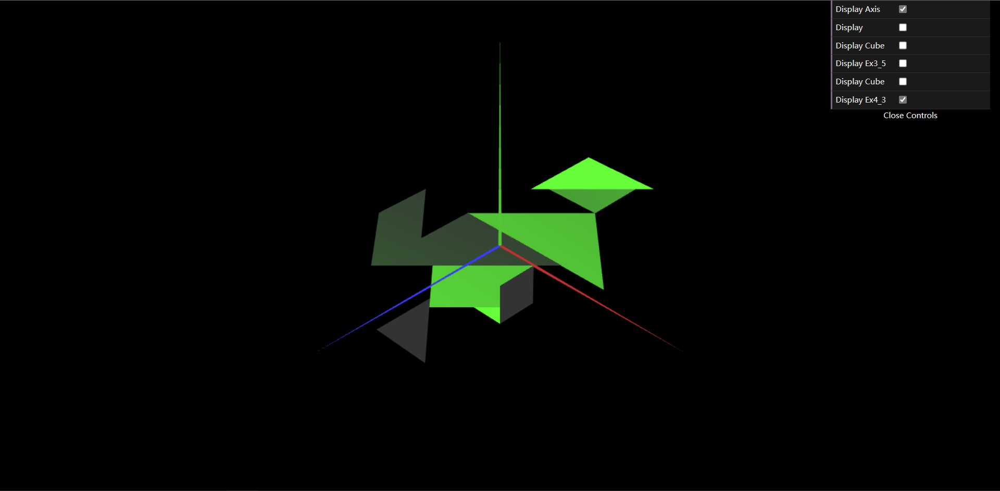

# CG 2022/2023

## Group T01G07

## TP 2 Notes

In the exercises 1: 

- we have learned how to make a geometric transformation (translation, rotation, scaling);
- we have learned how to create a class (tangram) that contains previously created shapes(diamond, triangle, paralelogram);
- we had difficulties in finding out the right transformation to make the tangram.

In the exercises 2:

- we have successfully created a cube from eight vertices;
- we had difficulties in finding out index of each vertex of the cube.

In the exercises 3:

- we have successfully created a cube from six faces;
- as the result, we didn't spot any differences from the last exercise.

<i>exercise 1</i>

<i>exercise 2</i>

<i>exercise 3</i>
