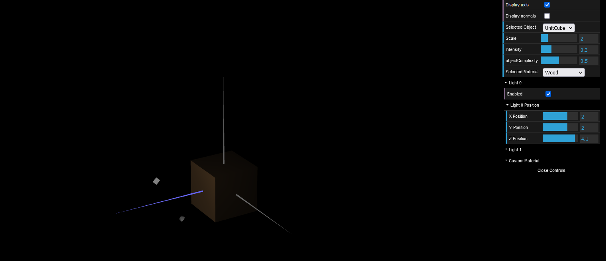
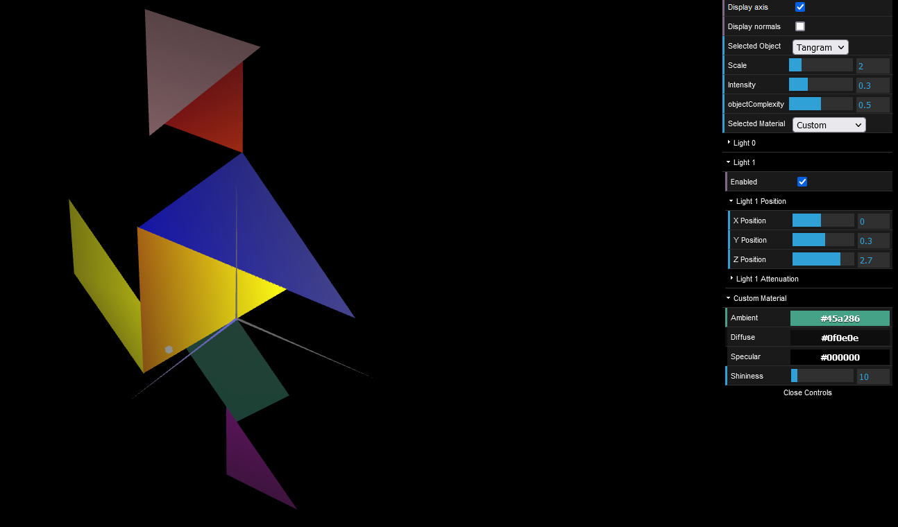
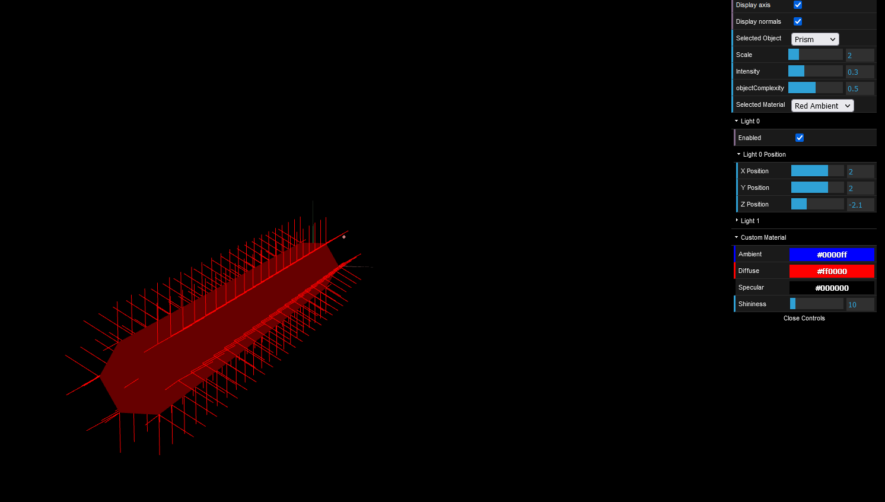
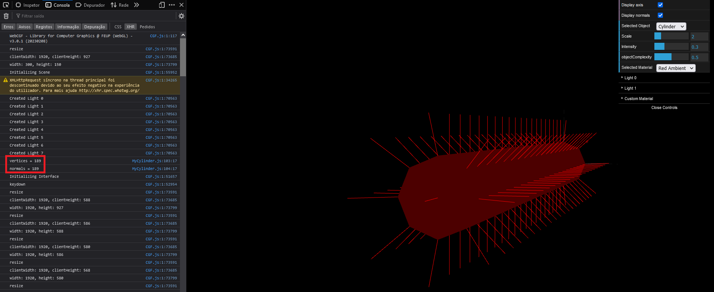

# CG 2022/2023

## Group T01G07

## TP 3 Notes

In the part 1: 

- We declared the normals of the objects.
- We created a new material ('Wood') and applied it to the objects.

In the part 2:

- We implemented Prism object, using functions to create the vertices, faces and normals by passing the number of slices and the stacks.
- We struggled a little bit during the implementation of the Prism object, but we managed to solve the problem.

In the part 3:

- We implemented the Cylinder object and modified the normals.

<i>picture 1</i>

<i>picture 2</i>

<i>picture 3</i>

<i>picture 4</i>
