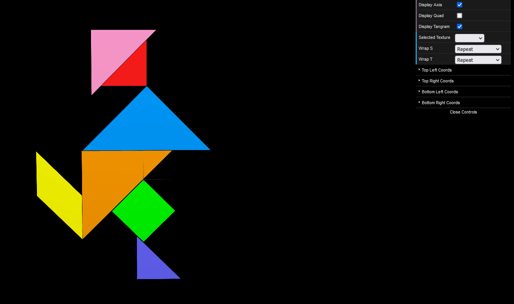
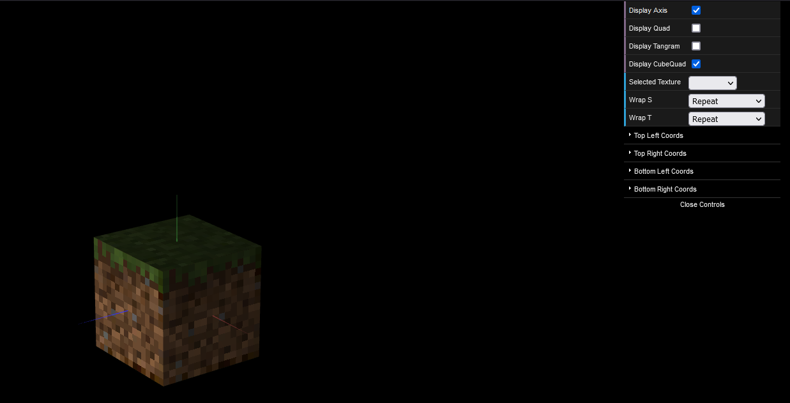

# CG 2022/2023

## Group T01G07

## TP 4 Notes

In the part 1, relatively to the Tangram: 

- We declared the texCoords for each object that composes the Tangram.
- We have struggled to find the right coordinate at first, but we managed to get through it.

In the part 2, relatively to the Cube:

- We recreated a dirt block from minecraft, applying the texture to our cube object previously implemented in the tp2.

<i>picture 1</i>

<i>picture 2</i>

