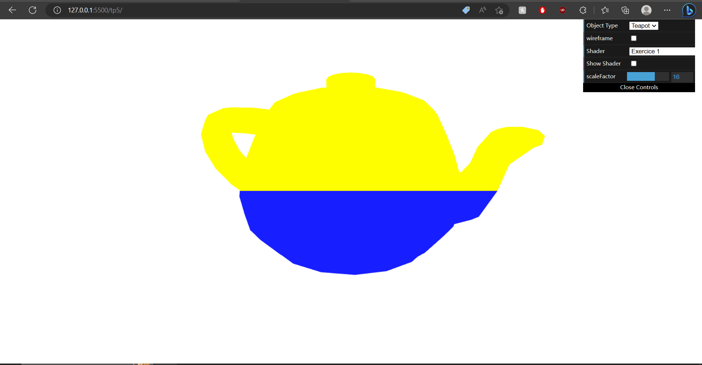
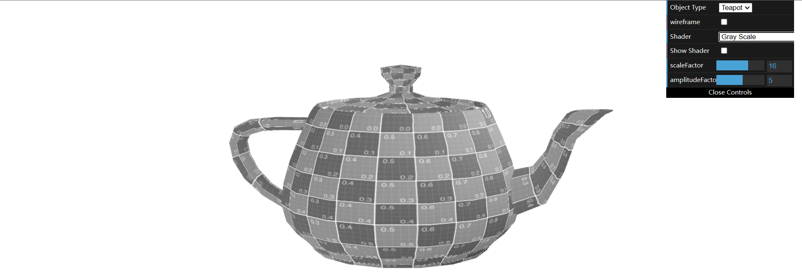
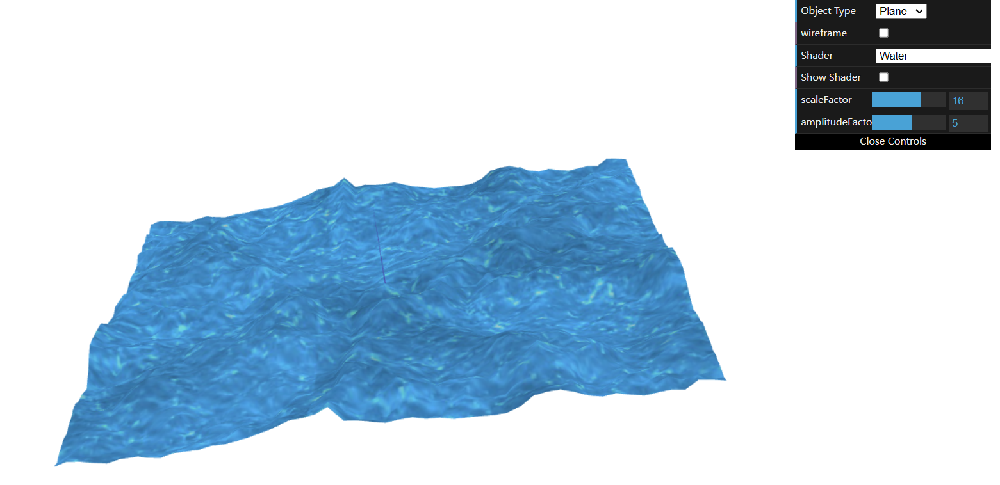

# CG 2022/2023

## Group T01G07

## TP 5 Notes

In the part 1 we:

- Created a new shader, which only applies certain colors to the object, depending on the position of the vertex in the object.
- Struggled to find the right condition to recognize the position of the vertices.
- Changed the shader texture3anim to make the object move along the XX axis.
- Created a new Fragment Shader based on Sépia that converts all colors to Grayscale.

In the part 2 we:

- Created a new shader that applies the water effect to the object.
- Struggled to find the right way to map the textures to the object.
- Struggled to replicate the effect of the water on the object presented in the video.

<i>picture 1</i>

<i>picture 2</i>

<i>picture 3</i>

